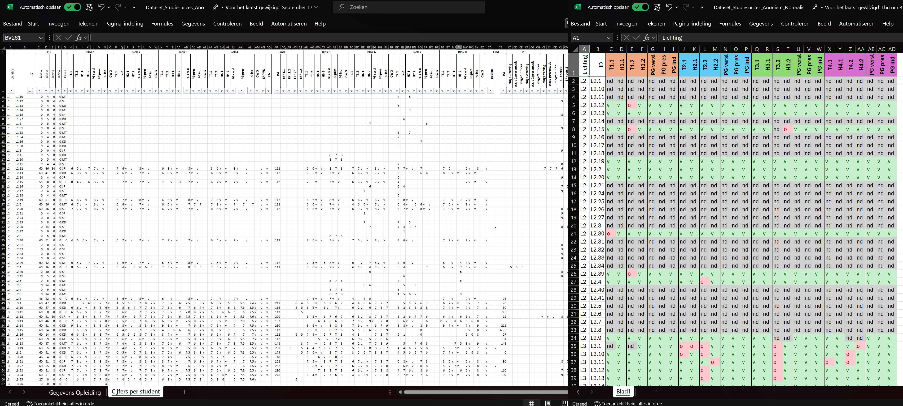
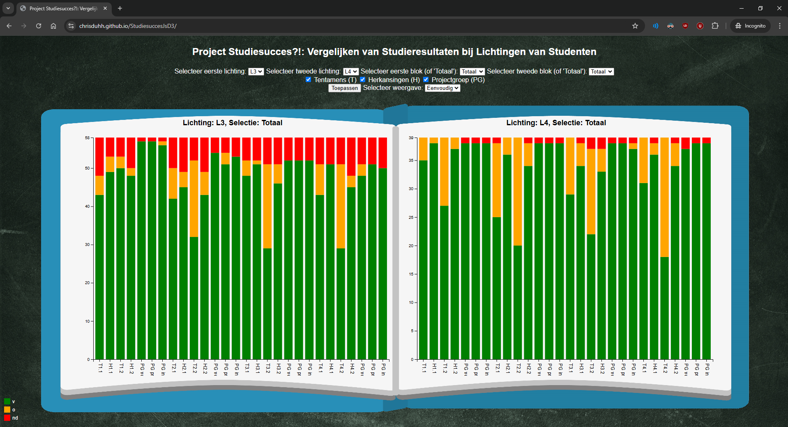

# StudiesuccesJsD3
Datavisualisatie Casus Zuyd

Vanuit de minor Data Visualisatie dienen we voor een opdrachtgever data inzichtelijk te kijken voor het vergelijken van studenten lichtingen.
Deze data dienen we visueel interactief in te zien per lichting. De cijfers hebben we van de dataset genormaliseerd naar Voldoende (V), Onvoldoende (O), en Niet Deelgenomen (ND) omgezet. (zie vergelijking hieronder)

Uit deze dataset hebben we een visuele, interactieve oplossing bedacht dat, naast visueel in de stijl van een school, ook de mogelijkheid geeft tot snel inzichtelijk overzicht van studieresultaten en de mogelijkheid tot het vergelijken van studieresultaten per leerjaar, of per blok.

Voorbeeld hoe de applicatie er op een standaard 16:9 desktop scherm uit ziet:

# [Pages link naar deze repository](https://chrisduhh.github.io/StudiesuccesJsD3/)

[Link naar de persoonlijke (back-up) repository](https://github.com/chrisduhh/StudiesuccesJsD3)
